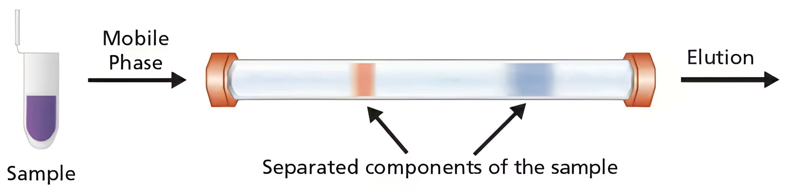

```{r}
#Functions
split_by_species <- function(df, species_col = "species") {
  split(df, df[[species_col]])
}

correct_baseline <- function(df, l = 1*10^7, meta_in = TRUE) {
  # keep metadata
  meta <- df |> select(time_point, species, sample, enzyme, instrument)
  
  # apply baseline correction only to numeric columns
  numeric_df <- df |> select(where(is.numeric))
  numeric_corrected <- baseline.corr(numeric_df, lambda = l, p = 0.001, eps = 1e-8)
  
  if (meta_in) {
  combined <- bind_cols(meta, numeric_corrected)
  return(combined)
  }
  return(numeric_corrected)
}


plot_by_time <- function(df, title_input = "Title") {
  df |> 
    filter(instrument == "DAD") |>
    mutate(sample_id = paste(enzyme, sample, time_point, species, sep = "_")) |>
    ggplot(
      aes(
        x = time,
        y = intensity,
        color = time_point,
        group = sample_id,
    )
  ) +
  geom_line() +

  scale_color_viridis_d(
      option = "viridis",
      name = "Incubation Time"
    )+ 

  labs(
    title = title_input,
    x = "Retention Time",
    y = "Intensity (au)",
    shape = "Species"
  )+

  theme(
    plot.title = element_text(face = "bold"), 
    axis.title.x = element_text(face = "bold"),         
    axis.title.y = element_text(face = "bold"))
  
}


wide_to_long <- function(df) {
  df |> 
    pivot_longer(
      cols = where(is.numeric),
      names_to = "time",
      values_to = "intensity"
    )
}

pca <- function(df, num_comp = 10, center_in = TRUE, scale_in = TRUE, scale_na = FALSE) {

  df <- df |> 
    mutate(time_point = factor(time_point, levels = c("0", "2", "5", "15", "30")))
  
  metadata <- df |> 
    select(!where(is.numeric))

  if (scale_na) {
  dataPCA <- df |>
    select(where(is.numeric)) |>
    mutate(across(
      everything(),
      ~ ifelse(is.na(.), min(., na.rm = TRUE) / 2, .)
    ))
  } else {
  dataPCA <- df |>
    select(where(is.numeric))
  }

  pca_res <- prcomp(dataPCA, center = center_in, scale. = scale_in)

  scores <- as.data.frame(pca_res$x[, 1:num_comp, drop = FALSE])
  scores <- bind_cols(metadata, scores)
  loadings <- as.data.frame(pca_res$rotation[, 1:num_comp, drop = FALSE])
  variance <- data.frame(variance = (pca_res$sdev^2) / sum(pca_res$sdev^2))

  list(
    df = df,
    scores = scores,
    loadings = loadings,
    variance = variance
  )
}


plot_scores <- function(scores, PC_first, PC_second, title_in = "", file_path = NULL) {

  PC_first  <- rlang::enquo(PC_first)
  PC_second <- rlang::enquo(PC_second)

  circle_df <- scores |> 
    group_by(species) |> 
    summarize(
      x0 = mean(!!PC_first, na.rm = TRUE),
      y0 = mean(!!PC_second, na.rm = TRUE),
      r = max(
        sqrt((!!PC_first - x0)^2 + (!!PC_second - y0)^2),
        na.rm = TRUE
      ),
      .groups = "drop"
    )

  label_positions <- circle_df |> 
    mutate(
      dx = x0 / sqrt(x0^2 + y0^2),
      dy = y0 / sqrt(x0^2 + y0^2),
      x = x0 + dx * (r * 1.08),
      y = y0 + dy * (r * 1.08)
    )

  p <- ggplot(scores, aes(x = !!PC_first, y = !!PC_second)) +

    geom_point(
      aes(color = time_point, shape = species),
      size = 3
    ) +

    # geom_label(
    #   data = label_positions,
    #   aes(x = x, y = y, label = species),
    #   inherit.aes = FALSE,
    #   fill = "white",
    #   color = "black",
    #   size = 3,
    #   label.size = 0.25
    # ) +

    scale_color_viridis_d(
      option = "viridis",
      name = "Incubation Time"
    ) +

    labs(
      title = title_in,
      subtitle = "Colored by incubation time; species-level dispersion shown",
      x = rlang::as_label(PC_first),
      y = rlang::as_label(PC_second),
      shape = "Species"
    ) +

    coord_equal() +
    theme_minimal()

  if (!missing(file_path) && !is.null(file_path)) {
  ggsave(
    filename = file_path,
    plot = last_plot(),
    dpi = 300,
    width = 8,
    height = 6,
    units = "in"
  )
  }
  return(p)
}

plot_loadings <- function(df, PC) {
  PC  <- rlang::enquo(PC)

  ggplot(df, aes(x = time, y = !!PC))+ 
  geom_line()+
  labs(title = "PCA Loadings Plot",
       x = "Time",
       y = rlang::as_label(PC)) +
  theme_minimal()
}

plot_scree <- function(df){
  df <- df |> 
  mutate(
    PC = factor(
      paste0("PC", row_number()),
      levels = paste0("PC", row_number())
    )
  )

  df_new <- df |> 
  mutate(cumulative = cumsum(variance)) |> 
  slice(1:10)
  
  ggplot(df_new, aes(x = PC, y = variance, group = 1)) +
  geom_line(linewidth = .7) +
  geom_point(size = 1) +
  geom_text(data = df_new |> slice(1:4),
            inherit.aes = FALSE,
            aes(x = PC, y = variance, label = paste0(round(cumulative*100), "%")), 
            vjust = -0.5, hjust = -.4, size = 3) +
  scale_y_continuous(labels = scales::percent_format(accuracy = 1)) +
  labs(
    title = "Scree Plot of Principal Components",
    x = "Principal Component",
    y = "Proportion of Variance Explained",
    caption = "Percentages indicate cumulative variance explained"
  ) +
  theme_minimal()
}

ptw_function <- function(df) {
  meta <- df |> 
    select(time_point, species, sample, enzyme, instrument)

  Num <- df |> select(where(is.numeric))

  reference_num <- Num[1, ]
  samples_num   <- Num[2:15, ]

  reference_meta <- meta[1, ]
  samples_meta   <- meta[2:15, ]

  res <- ptw(reference_num, samples_num, warp.type = "individual")

  warped_df <- as.data.frame(res$warped.sample)
  reference_df <- as.data.frame(res$reference)

  colnames(warped_df) <- colnames(reference_df)

  warped_full <- bind_cols(samples_meta, warped_df)
  reference_full <- bind_cols(reference_meta, reference_df)

  final_df <- bind_rows(reference_full, warped_full)

  return(final_df)
}
```

```{r}
library(arrow)
library(tidyverse) # for data manipulation and visualization
library(patchwork) # for combining plots
library(here) # for file path management
library(ptw)
library(ggrepel)

#Tab one baseline correction
combinedWide <- read_parquet("data/processed/combinedWide.parquet")
combinedWide <- combinedWide |> 
  mutate(time_point = factor(time_point, levels = c("0", "2", "5", "15", "30")))
combinedLong <- read_parquet("data/processed/combinedLong.parquet")
combinedLong <- combinedLong |> 
  mutate(time_point = factor(time_point, levels = c("0", "2", "5", "15", "30")))
```

## Me {.smaller}
I am a junior at The College of Idaho.<br>

I run track, mainly pole vaulting.

Last summer I worked with large spectral datasets that looked like:
{width=60%}\

## Ecology 
Sagebrush is vast<br>
- There are many species of sagebrush. <br>
- Each subspecies of sagebrush has a unqiue chemical profile.

Sagegrouse diet is in large part sagebrush.<br>
- Enzymes in the grouse liver modify defensive chemicals.

## Data
The samples are run on a Liqud Chromatograph-Mass Spectrometer (LC-MS) and we get the following chromatograms. 
```{r}
combinedLong |> 
  filter(instrument == "DAD") |> 
  mutate(sample_id = paste(enzyme, sample, time_point, species, sep = "_")) |>
    ggplot(
      aes(
        x = time,
        y = intensity,
        color = time_point,
        group = sample_id,
    ))+
    geom_line(alpha = .7)+
    facet_wrap(~species)+
    scale_color_viridis_d(
      option = "viridis",
      name = "Incubation Time"
      )+
    labs(
      title = "Raw Spectra of Each Species",
      x = "Retention Time",
      y = "Intensity (au)"
    )+
    theme(
      plot.title = element_text(face = "bold"), 
      axis.title.x = element_text(face = "bold"),         
      axis.title.y = element_text(face = "bold"))
  
```

## Principal Component Analysis (PCA)
**A dimensionality reduction technique**

* PCA accounts for variation between samples. 
* We hope to track the digestion of defensive compounds.


```{r}
#| layout-ncol: 1
#| fig-width: 12
#| fig-height: 6
result_raw <- pca(combinedWide, center_in = FALSE, scale_in = FALSE)

scores_raw <- as.data.frame(result_raw$scores)

plot_scores(scores_raw, PC1, PC2, title_in = "Raw Spectra Score Plot")
```

## Sections
With this in mind we will get into the following sections. <br>
<br>

* **Section 1**: Samples, Instrument, Data

* **Section 2**: Preprocessing

## Samples {.smaller}

- Enzymes: Present in microsomes of the grouse liver 
- Substrate(s): The sagebrush extract
- Co-factor: Selects enzyme
- Buffers and Acetonitrile

Samples vary in [incubation time]{.underline}.<br>
This is how we are able to track changes in the grouse digestion over time.

## The Liquid Chromatogram (LC) {.smaller}
The column separates metabolites by [retention time]{.underline} (rt).<br>



# PreProcessing

## Initial Pipe Line 
* Baseline correction
* Alignment
* Standardizing  

## Baseline 
::: {.panel-tabset}

### Green
```{r}
species_df = split_by_species(combinedWide)

green <- species_df[['green']]
greenMeta <-  green |> select(1:5)

greenWide <- correct_baseline(green, 1*10^9) 

greenLong <- wide_to_long(greenWide)
greenLong_raw <- wide_to_long(green)

plot_by_time(greenLong, title_input = "Baseline Corrected")
plot_by_time(greenLong_raw, title_input = "Raw Spectra")
```

### White
```{r}
white <- species_df[['white']]
whiteMeta <-  white |> select(1:5)

whiteWide <- correct_baseline(white, 1*10^9) 

whiteLong <- wide_to_long(whiteWide)
whiteLong_raw <- wide_to_long(white)

plot_by_time(whiteLong, title_input = "Baseline Corrected")
plot_by_time(whiteLong_raw, title_input = "Raw Spectra")
```

### Early
```{r}
#| echo: true
early <- species_df[['early']]
earlyMeta <-  early |> select(1:5)

earlyWide <- correct_baseline(early, 1*10^9) 

earlyLong <- wide_to_long(earlyWide)
earlyLong_raw <- wide_to_long(early)

plot_by_time(earlyLong, title_input = "Baseline Corrected")
plot_by_time(earlyLong_raw, title_input = "Raw Spectra")
```

### Wyoming
```{r}
#| echo: true
wyoming <- species_df[['wyoming']]
wyomingMeta <-  wyoming |> select(1:5)

wyomingWide <- correct_baseline(wyoming, 1*10^9) 

wyomingLong <- wide_to_long(wyomingWide)
wyomingLong_raw <- wide_to_long(wyoming)

plot_by_time(wyomingLong, title_input = "Baseline Corrected")
plot_by_time(wyomingLong_raw, title_input = "Raw Spectra")
```
:::

## Baseline Corrected PCA 
::: {.panel-tabset} 

### PC1 & PC2
```{r}
#| layout-ncol: 1
#| fig-width: 12
#| fig-height: 6
totalWide_baseline <- bind_rows(wyomingWide, earlyWide, whiteWide, greenWide)

res_raw <- pca(combinedWide)
res_baseline <- pca(totalWide_baseline)

scores_raw <- res_raw$scores
scores_baseline <- res_baseline$scores

plot_scores(scores_baseline, PC1, PC2, title_in = "Baseline Corrected Score Plot")
plot_scores(scores_raw, PC1, PC2, title_in = "Raw Data Score Plot")
```

### PC1 & PC3
```{r}
#| layout-ncol: 1
#| fig-width: 12
#| fig-height: 6
totalWide_baseline <- bind_rows(wyomingWide, earlyWide, whiteWide, greenWide)

result_raw <- pca(combinedWide)
res_baseline <- pca(totalWide_baseline)

scores_raw <- res_raw$scores
scores_baseline <- res_baseline$scores

plot_scores(scores_baseline, PC1, PC3, title_in = "Baseline Corrected Score Plot")
plot_scores(scores_raw, PC1, PC3, title_in = "Raw Data Score Plot")
```

### PC2 & PC3
```{r}
#| layout-ncol: 1
#| fig-width: 12
#| fig-height: 6
plot_scores(scores_baseline, PC2, PC3, title_in = "Baseline Corrected Score Plot")
plot_scores(scores_raw, PC2, PC3, title_in = "Raw Data Score Plot")
```
:::

## Alignment
::: {.panel-tabset}
```{r}
greenPTW <- read_parquet("data/processed/greenPTW.parquet")
whitePTW <- read_parquet("data/processed/whitePTW.parquet")
earlyPTW <- read_parquet("data/processed/earlyPTW.parquet")
wyomingPTW <- read_parquet("data/processed/wyomingPTW.parquet")
totalWide_PTW <- bind_rows(greenPTW, earlyPTW, whitePTW, wyomingPTW) |> 
  mutate(time_point = factor(time_point, levels = c("0", "2", "5", "15", "30")))
greenLong_PTW <- wide_to_long(greenPTW)
whiteLong_PTW <- wide_to_long(whitePTW)
earlyLong_PTW <- wide_to_long(earlyPTW)
wyomingLong_PTW <- wide_to_long(wyomingPTW)

greenLong_PTW <- greenLong_PTW |> 
  mutate(time_point = factor(time_point, levels = c("0", "2", "5", "15", "30")))

whiteLong_PTW <- whiteLong_PTW |> 
  mutate(time_point = factor(time_point, levels = c("0", "2", "5", "15", "30")))

earlyLong_PTW <- earlyLong_PTW |> 
  mutate(time_point = factor(time_point, levels = c("0", "2", "5", "15", "30")))

wyomingLong_PTW <- wyomingLong_PTW |> 
  mutate(time_point = factor(time_point, levels = c("0", "2", "5", "15", "30")))
```

### Green
```{r}
plot_by_time(greenLong_PTW)
```

### White
```{r}
plot_by_time(whiteLong_PTW)
```

### Early
```{r}
plot_by_time(earlyLong_PTW)
```

### Wyoming
```{r}
plot_by_time(wyomingLong_PTW)
```

:::

## Aligned PCA
::: {.panel-tabset}
```{r}
result_PTW <- pca(totalWide_PTW, scale_na = TRUE)

scores <- as.data.frame(result_PTW$scores)
```

### PC1 & PC2
```{r}
plot_scores(scores, PC1, PC2, title_in = "Aligned Score Plot")
```

### PC1 & PC3
```{r}
plot_scores(scores, PC1, PC3, title_in = "Aligned Score Plot")
```

### PC2 & PC3
```{r}
plot_scores(scores, PC2, PC3, title_in = "Aligned Score Plot")
```

:::

## Standardizing
Equalizes the importance of different metabolites. 

* Low concentration compounds are weighted more heavily<br>

First, center a variable and divide by the dispersion measure, typically standard deviation.

## Normalizing
Accounts for between sample variation.<br>
<br>
It involves calculating a scale factor and adjusting an entire spectrum.<br>

Examples:

* Equalize total integral of each spectrum
* Normalize with the weight of sagebrush biomass.

## Standardize 
```{r}
#| echo: true
result_unscaled <- pca(combinedWide, center_in = FALSE, scale_in = FALSE)
result_scaled <- pca(combinedWide)

scores_unscaled <- as.data.frame(result_unscaled$scores)
scores_scaled <- as.data.frame(result_scaled$scores)

plot_scores(scores_scaled, PC1, PC2, title_in = "Standardized Score Plot")
plot_scores(scores_unscaled, PC1, PC2, title_in = "Unstandardized Score Plot")
```

## Discussion

* Alignment: Which sample to align to within a species? 
  + Should we align between species? 
    - Even with substantial differences in chromatogram profiles
* Baseline Correction: Evaluating parameters
  + Over-correction risks removing biologically meaningful signal
  + Under-correction increases noise in multivariate models
* Standardizing vs Normalizing
  + Standardization emphasizes relative variance across features
  + Normalization adjusts samples so they are comparable to each other

## Future Directions

* Incorporating MS spectra
  + Peak identification
* Different models
  + Tracking covariance between variables
  + Non-linear model

# Appendix

## Each Species Plotted
```{r}
combinedLong |> 
  filter(instrument == "DAD") |>
  mutate(sample_id = paste(enzyme, sample, time_point, species, sep = "_")) |>
  ggplot(
      aes(
        x = time,
        y = intensity,
        color = species,
        group = sample_id,
    )
  ) +
  geom_line() +
  labs(
    title = "All Species Raw Spectra",
    x = "Retention Time",
    y = "Intensity (au)",
  )+
  theme(
    plot.title = element_text(face = "bold"), 
    axis.title.x = element_text(face = "bold"),         
    axis.title.y = element_text(face = "bold"))
  
```

## Green
```{r}
plot_by_time(greenLong_raw, title_input = "Green")
```

## White
```{r}
plot_by_time(whiteLong_raw, title_input = "White")
```

## Early
```{r}
plot_by_time(earlyLong_raw, title_input = "Early")
```

## Wyoming
```{r}
plot_by_time(wyomingLong_raw, title_input = "Wyoming")
```

## Baseline tuning of parameters
:::{.panel-tabset}
```{r}
#| echo: true
greenWide_l1 <-  correct_baseline(green, meta_in = TRUE, l = 1*10^7)
greenWide_l2 <-  correct_baseline(green, meta_in = TRUE, l = 1*10^8)
greenWide_l3 <-  correct_baseline(green, meta_in = TRUE, l = 1*10^9)
greenWide_l4 <-  correct_baseline(green, meta_in = TRUE, l = 1*10^10)


greenLong_l1 <- wide_to_long(greenWide_l1)
greenLong_l2 <- wide_to_long(greenWide_l2)
greenLong_l3 <- wide_to_long(greenWide_l3)
greenLong_l4 <- wide_to_long(greenWide_l4)
```

### λ = 1*10^7
```{r}
plot_by_time(greenLong_l1, title_input = "Baseline Corrected l1")
```

### λ = 1*10^8
```{r}
plot_by_time(greenLong_l2, title_input = "Baseline Corrected l2")
```

### λ = 1*10^9
```{r}
plot_by_time(greenLong_l3, title_input = "Baseline Corrected l3")
```

### λ = 1*10^10
```{r}
plot_by_time(greenLong_l4, title_input = "Baseline Corrected l4")
```

:::

## Asymmetric Least Squares Baseline Algorithm
In order to minimize the baseline artifact, we use baseline.corr() from ptw package. This baseline correction is based on the asymmetric least squares algorithm. The function works by estimating the baseline and subtracting it from each spectrum. The baseline is estimated with a weighted least squares algorithm.

The algorithm is iterative. This means it uses an algorithm to estimate the baseline and iteratively test the baseline, making adjustments until convergence.

The algorithm is based on weighted least squares. We want to weight the variance above and below the estimated baseline. Variation above the baseline should be weighted very small as this variation is mostly coming from peaks. The variation below is weighted heavily, at convergence there should be little variation below the baseline. 

The adjustment made between iterations is the weight (p) of the variance. The asymmetry parameter p (small, typically 0.001 to start) is the weight of points above the trendline, 1-p is the weight of points below the trendline. 

There is also a smoothing parameter $\lambda$. 

The ALS algorithm estimates a smooth baseline $z$ under a signal $y$ by minimizing the following objective function:

$$
\min_{z} \; \sum_{i=1}^{n} w_i \, (y_i - z_i)^2 \;+\; \lambda \sum_{i=2}^{n-1} (z_{i-1} - 2 z_i + z_{i+1})^2
$$

where:

- $y_i$ : observed signal at point $i$  
- $z_i$ : estimated baseline at point $i$  
- $w_i$ : asymmetric weights, updated iteratively:

$$
w_i =
\begin{cases} 
p, & \text{if } y_i > z_i \\[2mm]
1 - p, & \text{if } y_i \le z_i
\end{cases}
$$

- $\lambda$ : smoothing parameter controlling baseline smoothness  
- $p$ : asymmetry parameter (small values keep the baseline below peaks)  

**Notes:**

- The second term $\sum (z_{i-1} - 2z_i + z_{i+1})^2$ is a discrete approximation of the second derivative, enforcing smoothness.
- The weights $w_i$ are updated iteratively until convergence, allowing the baseline to ignore peaks above it.

## Alignment Notes
Alignment to a selected peak is possible but I expect this to be hard to automate. This has a use case in comparing between species.

## Deconvolution
In complex LC-MS data, signals often overlap. Advanced strategies use deconvolution to model single-metabolite contributions, separating them from the raw signal (and baseline) to derive "pure" chromatograms for calculating relative concentrations.

## The Parametric Time Warping Function 

The PTW function fits a polynomial model of degree K for the warping function $w(t_i)$. The function is used to align a sample signal $S(t_i)$ to a reference signal $R(t_i)$. 

The warping function $w(t_i)$ describes which value $S(w(t_j))$ to match with $R(t_j)$. Essentially the warping function is mapping a value for the sample signal to match to the corresponding value from the reference sample. 

Importantly, these values have to be calculated by linear interpolation.

$\hat{S}(t_j) = S(w(t_j)) = S(t_i) + (w(t_j)-t_i) * (S(t_{i+1}) - S(t_i))$

The value of the predicted sample signal at time $t_j$ is described using the warping function. 

$S(t_j)$ is calculated by adding the value of the previous sample signal to a scaled difference of the next signal value and current; $S(t_{i+1}) - S(t_i)$

**With**
$$
i, j \text{   } \epsilon \text{   } (1, ..., m)
$$
m: Total number of time points in the chromatogram

**And**
$$
t_i \leq w(t_j) \leq t_{i+1}
$$

The original version of this algorithm used Root Mean Squared difference between reference and warped sample as a loss function, optimized to find the best warping function parameters. The new implementation uses WCC as a loss function.


# Loadings

## Raw Spectra Loadings
::: {.panel-tabset}
### PC1
```{r}
loadings_raw <- as_tibble(result_raw$loadings, rownames = "time") |> 
  mutate(time = as.numeric(time))

plot_loadings(loadings_raw, PC1)
```

### PC2
```{r}
plot_loadings(loadings_raw, PC2)
```

### PC3
```{r}
plot_loadings(loadings_raw, PC3)
```

:::

## Baseline Corrected Loadings
::: {.panel-tabset}
### PC1
```{r}
loadings_baseline <- as_tibble(res_baseline$loadings, rownames = "time") |> 
  mutate(time = as.numeric(time))

plot_loadings(loadings_baseline, PC1)
```

### PC2
```{r}
plot_loadings(loadings_baseline, PC2)
```

### PC3
```{r}
plot_loadings(loadings_baseline, PC3)
```

:::

## Baseline Corrected and Aligned Loadings
::: {.panel-tabset}
### PC1
```{r}
loadings_PTW <- as_tibble(result_PTW$loadings, rownames = "time") |> 
  mutate(time = as.numeric(time))

plot_loadings(loadings_PTW, PC1)
```

### PC2
```{r}
plot_loadings(loadings_PTW, PC2)
```

### PC3
```{r}
plot_loadings(loadings_PTW, PC3)
```

:::

## Standardized Loadings
::: {.panel-tabset}
### PC1
```{r}
loadings_scaled <- as_tibble(result_scaled$loadings, rownames = "time") |> 
  mutate(time = as.numeric(time))

plot_loadings(loadings_scaled, PC1)
```

### PC2
```{r}
plot_loadings(loadings_scaled, PC2)
```

### PC3
```{r}
plot_loadings(loadings_scaled, PC3)
```

:::

## Baseline Corrected and Aligned Scree Plot
```{r}
var_PTW <- result_PTW$variance

plot_scree(var_PTW)
```

## LC Info
The liquid chromatogram utilizes a stationary phase column and a liquid mobile phase to separate a mixture of metabolites out by their based on their relative binding affinity. This affinity is determined by polarity, size, and charge. Typically, the column is more polar than the mobile phase and therefore the less polar metabolites are eluted faster. The column is a fine adsorbent solid which can hold onto metabolites on its outer surface. 

# Scree

## Raw Spectra Scree
```{r}
variance_raw <- result_raw$variance

plot_scree(variance_raw)
```

## Baseline Corrected Scree
```{r}
variance_baseline <- res_baseline$variance

plot_scree(variance_baseline)
```

## Aligned Scree
```{r}
variance_PTW <- result_PTW$variance

plot_scree(variance_PTW)
```

## Standardized Scree
```{r}
variance_scaled <- result_scaled$variance

plot_scree(variance_scaled)
```